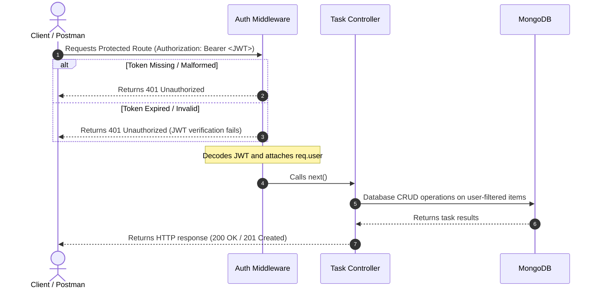

# Practical 7: Authentication and Middleware Pipeline

This project implements an secure Authentication and Middleware Pipeline for a Full-Stack Task Management Application. It protects task resources so that only authenticated users can perform CRUD operations on their own tasks.

## 🚀 Technologies Used
- **Backend**: Node.js, Express.js, MongoDB (Mongoose ODM), JWT (`jsonwebtoken`), bcryptjs, dotenv, multer
- **Frontend**: React.js (Vite), React Router v6, Vanilla CSS (with sleek light/dark themes)
- **API Testing**: Postman / Newman

---

## 🛠️ Installation & Setup

### Prerequisites
- Node.js (v18+)
- MongoDB Community Server (running locally on port `27017`)

### 1. Database Setup
Ensure your local MongoDB instance is running. You can check or start it via:
```powershell
# Windows Command Prompt / PowerShell
net start MongoDB
```

### 2. Backend Installation
Navigate to the backend directory and install dependencies:
```bash
cd task-manager-api-24AIML063
npm install
```

### 3. Environment Variables Configuration
Create a `.env` file in the root of the `task-manager-api-24AIML063` folder:
```env
PORT=5000
MONGO_URI=mongodb://127.0.0.1:27017/task_management
JWT_SECRET=replace_with_a_strong_secret
JWT_EXPIRES_IN=1h
```

A template is also available in `.env.example`. Do not commit `.env` to version control.

### 4. Start the Backend
```bash
npm start
# Or for hot-reloading:
npm run dev
```
The server will start on port `5000` and output:
```text
Server running on port 5000
MongoDB connected
```

### 5. Frontend Installation
Navigate to the frontend folder `student-portfolio` and install dependencies:
```bash
cd student-portfolio
npm install
```

### 6. Start the Frontend
```bash
npm run dev
```
The application will be served at `http://localhost:5173/`.

---

## 🔐 Authentication & Middleware Pipeline Flow



---

## 📋 API Reference

| Method | Endpoint | Auth Required | Purpose | Success | Error Statuses |
| :--- | :--- | :---: | :--- | :---: | :---: |
| **POST** | `/api/auth/register` | No | Register a new user | `201` | `400` (Validation), `409` (Conflict) |
| **POST** | `/api/auth/login` | No | Login and get JWT | `200` | `400` (Missing credentials), `401` (Unauthorized) |
| **GET** | `/api/auth/me` | **Yes** | Get current user profile | `200` | `401` (Unauthorized / expired token) |
| **GET** | `/api/tasks` | **Yes** | Fetch paginated tasks for active user | `200` | `401` (Unauthorized) |
| **POST** | `/api/tasks` | **Yes** | Create a task owned by user | `201` | `400` (Validation error), `401` |
| **GET** | `/api/tasks/:id` | **Yes** | Retrieve single owned task | `200` | `400` (Bad ID), `401`, `404` (Not Found) |
| **PUT** | `/api/tasks/:id` | **Yes** | Update single owned task | `200` | `400` (Validation), `401`, `404` |
| **DELETE** | `/api/tasks/:id` | **Yes** | Delete single owned task | `200` | `400` (Bad ID), `401`, `404` |

---

## 📮 Postman Setup & Automated Testing

A complete Postman collection and environment config are included under the backend folder:
- **Collection JSON**: [Practical-7-Auth.postman_collection.json](file:///c:/Users/Administrator/Desktop/portfolio/task-manager-api-24AIML063/Practical-7-Auth.postman_collection.json)
- **Environment JSON**: [Practical-7-Auth.postman_environment.json](file:///c:/Users/Administrator/Desktop/portfolio/task-manager-api-24AIML063/Practical-7-Auth.postman_environment.json)

### Executing via Postman Runner:
1. Import both JSON files into your Postman application.
2. Select the `Practical-7-Auth-Env` environment from the environment dropdown.
3. Use the Collection Runner to run the requests sequentially:
   1. **Register** - Creates the test user credentials.
   2. **Login** - Authenticates and automatically extracts the token to the environment variable.
   3. **Get Me** - Fetches profile info and verifies the email matching.
   4. **Create Task** - Creates a task and automatically extracts `taskId` for downstream tests.
   5. **Get All Tasks** - Verifies paginated array fetching.
   6. **Get Single Task** - Retrieves the specific task.
   7. **Update Task** - Changes title/completion status.
   8. **Delete Task** - Removes the task.
   9. **Negative Tests** - Asserts correct error codes (`400`, `401`, `409`) for malformed requests, wrong passwords, missing/expired tokens, and duplicates.

### Executing via Command Line (Newman):
Ensure the backend server is running, then execute:
```bash
npx newman run Practical-7-Auth.postman_collection.json -e Practical-7-Auth.postman_environment.json
```

---

## 🔒 Security Practices Implemented
1. **Password Hashing**: Done using `bcryptjs` (salt rounds: 10). Plain passwords are never saved.
2. **Password Selection Restriction**: Users password schema specifies `select: false` to ensure password hashes are not loaded into memory or sent back in standard queries.
3. **Stateless Auth (JWT)**: Tokens expire in `1h` (or as configured). Verification happens on every request inside a `try/catch` wrapper to ensure server stability.
4. **Task Ownership Boundaries**: Every task matches `{ _id: id, user: req.user.id }` for read, write, update and delete requests, preventing cross-user data tampering.
5. **Dotenv Config Isolation**: Variables are stored strictly outside the codebase and excluded via `.gitignore`.
